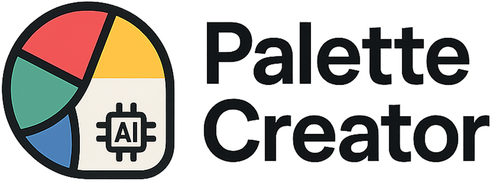

<a id="readme-top"></a>


<!-- PROJECT SHIELDS -->
<div align="center">

[![Stargazers][stars-shield]][stars-url]
[![Issues][issues-shield]][issues-url]
[![MIT License][license-shield]][license-url]
[![LinkedIn][linkedin-shield]][linkedin-url]

</div>


<!-- PROJECT LOGO -->
<br />
<div align="center">
  <a href="https://github.com/weebik/palette-creator">
    
  </a>

<h3 align="center">Palette Creator</h3>
  <p align="center">
    A web app that generates custom color palettes based on user descriptions using AI. Built with Vue.js, Express.js, Tailwind CSS, and TypeScript. Utilizes Groq for AI-driven color palette creation.
    <br />
    <br />
    <a href="">Visit</a>
    ·
    <a href="https://github.com/weebik/palette-creator/issues/">Report Bug</a>
    ·
    <a href="https://github.com/weebik/palette-creator/issues/">Request Feature</a>
  </p>
</div>


<!-- TABLE OF CONTENTS -->
<details>
  <summary>Table of Contents</summary>
  <ol>
    <li>
      <a href="#about-the-project">About The Project</a>
      <ul>
        <li><a href="#built-with">Built With</a></li>
        <li><a href="#structure">Project Structure</a></li>
      </ul>
    </li>
    <li>
      <a href="#contributing">Contributing</a>
      <ul>
        <li><a href="#reporting-issues">Reporting issues</a></li>
        <li><a href="#suggesting-improvements">Suggesting improvements</a></li>
      </ul>
    </li>
    <li><a href="#license">License</a></li>
    <li><a href="#contact">Contact</a></li>
    <li><a href="#todos">Todo</a></li>
  </ol>
</details>


<!-- ABOUT THE PROJECT -->
## About The Project

This project is built with Vue 3 framework using TypeScript. The styles are crafted with Tailwind CSS for a modern and responsive design. The color palette generation leverages the Groq AI API for intelligent palette creation based on user prompts. The backend API is built with Express.js and TypeScript, serving requests securely and efficiently. Email functionality is integrated using EmailJS to handle contact form submissions without requiring a dedicated mail server.

<p align="right">(<a href="#readme-top">back to top</a>)</p>


### Built With
[![Vue][Vue.js]][Vue-url]
[![Express][Express.js]][Express-url]
[![Tailwind][TailwindCSS]][Tailwind-url]
[![Typescript][Typescript]][Typescript-url]
[![Vercel][Vercel]][Vercel-url]
[![Render][Render]][Render-url]

<p align="right">(<a href="#readme-top">back to top</a>)</p>

### Project Structure

```
palette-creator/
├── server/
│   ├── controllers/
│   ├── routes/
│   └── services/
└── client/
    ├── public/
    ├── src/
    │   ├── assets/
    │   ├── components/
    │   ├── pages/
    │   ├── router/
    │   ├── App.vue
    │   ├── main.ts
    │   └── style.css
    └── index.html
```

<p align="right">(<a href="#readme-top">back to top</a>)</p>

<!-- CONTRIBUTING -->
## Contributing
Thank you for your interest in contributing to my project! Your feedback and suggestions are invaluable in making this app better. Below are some ways you can contribute:

<p align="right">(<a href="#readme-top">back to top</a>)</p>

### Reporting Issues  
If you find any bugs or issues, please let me know by creating a [GitHub issue](https://github.com/weebik/palette-creator/issues/). When reporting, try to include:  
- A clear description of the issue.  
- Steps to reproduce the problem.  
- Screenshots or error messages, if applicable.  

<p align="right">(<a href="#readme-top">back to top</a>)</p>

### Suggesting Improvements  
Your ideas on how to improve the project are always welcome! Feel free to:  
- Suggest ways to optimize the code for better performance.  
- Propose changes to make the code more readable and maintainable.  
- Recommend new features or enhancements that align with the project's goals. You can do that via [Request feature](https://github.com/weebik/palette-creator/issues/) form.

<p align="right">(<a href="#readme-top">back to top</a>)</p>

<!-- LICENSE -->
## License
This project uses the **MIT License**. Details in [LICENSE](https://github.com/weebik/palette-creator/blob/main/LICENSE).

<p align="right">(<a href="#readme-top">back to top</a>)</p>


<!-- CONTACT -->
## Contact

Krystian Ćwikliński - krystian.samaa@gmail.com

Project Link: [https://github.com/weebik/palette-creator](https://github.com/weebik/palette-creator)

<p align="right">(<a href="#readme-top">back to top</a>)</p>


## Todo

* Improvments in mobile views and responsiveness
* Some style changes (animations, icons)
* Code refactor
* New features and future improvements

<p align="right">(<a href="#readme-top">back to top</a>)</p>


<!-- MARKDOWN LINKS & IMAGES -->
[contributors-shield]: https://img.shields.io/github/contributors/weebik/weebsite.svg?style=for-the-badge
[contributors-url]: https://github.com/weebik/weebsite/graphs/contributors
[forks-shield]: https://img.shields.io/github/forks/weebik/weebiste.svg?style=for-the-badge
[forks-url]: https://github.com/weebik/weebsite/network/members
[stars-shield]: https://img.shields.io/github/stars/weebik/weebsite.svg?style=for-the-badge
[stars-url]: https://github.com/weebik/weebsite/stargazers
[issues-shield]: https://img.shields.io/github/issues/weebik/weebsite.svg?style=for-the-badge
[issues-url]: https://github.com/weebik/weebsite/issues
[license-shield]: https://img.shields.io/badge/License-MIT-yellow.svg?style=for-the-badge
[license-url]: https://img.shields.io/github/license/weebik/weebsite%2Ffrontend%2FLICENSE.TXT
[linkedin-shield]: https://img.shields.io/badge/-LinkedIn-black.svg?style=for-the-badge&logo=linkedin&colorB=555
[linkedin-url]: https://www.linkedin.com/in/weebik/
[Typescript]: https://img.shields.io/badge/typescript-%23007ACC.svg?style=for-the-badge&logo=typescript&logoColor=white
[Typescript-url]: https://www.typescriptlang.org
[Vercel]:https://img.shields.io/badge/vercel-%23000000.svg?style=for-the-badge&logo=vercel&logoColor=white
[Vercel-url]:https://vercel.com
[Render]:https://img.shields.io/badge/Render-%46E3B7.svg?style=for-the-badge&logo=render&logoColor=white
[Render-url]:https://render.com
[Vue-url]:https://vuejs.org
[Vue.js]:https://img.shields.io/badge/vuejs-%2335495e.svg?style=for-the-badge&logo=vuedotjs&logoColor=%234FC08D
[TailwindCSS]:https://img.shields.io/badge/tailwindcss-%2338B2AC.svg?style=for-the-badge&logo=tailwind-css&logoColor=white
[Tailwind-url]:https://tailwindcss.com
[Express.js]:https://img.shields.io/badge/express.js-%23404d59.svg?style=for-the-badge&logo=express&logoColor=%2361DAFBcom
[Express-url]:https://expressjs.com